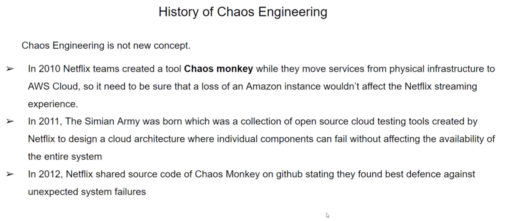

# Choas Engineering

## History 



## What is Chaos Engineering 


## How to Install the Chaos Toolkit


### Install Python for your system:

On MacOS X:


```bash
  brew install python3
```

Create a virtual environment:

```bash
  python3 -m venv ~/.venvs/chaostk
```

Make sure to always activate your virtual environment before using it:

```bash
  source  ~/.venvs/chaostk/bin/activate
```


### Install chaostoolkit in the virtual environment as follows:

```bash
  pip install -U chaostoolkit
```

You can verify the command was installed by running:

```bash
chaos --version
```